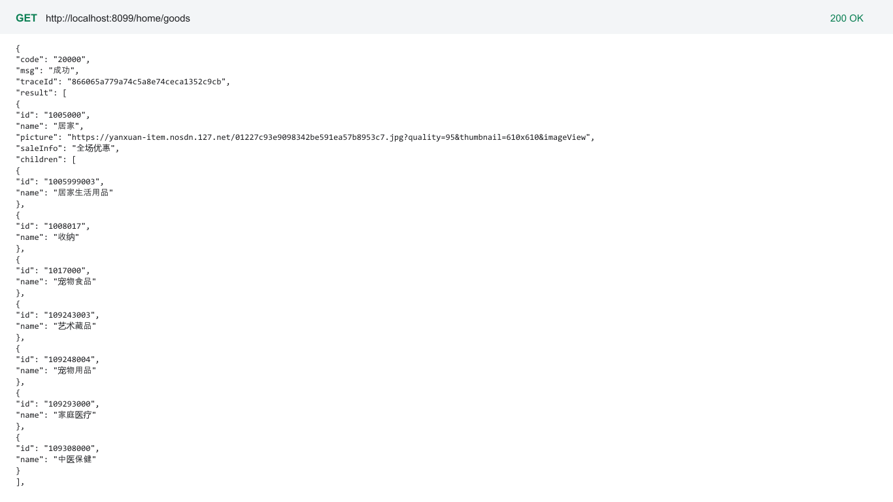
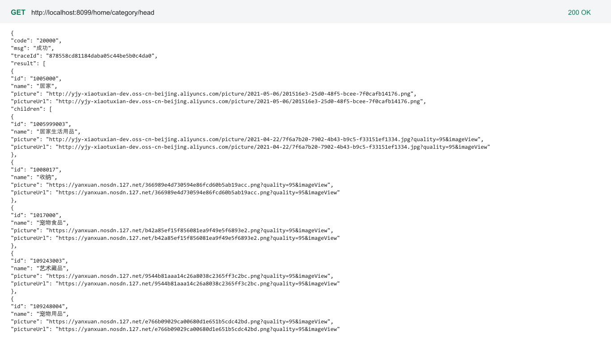

# 小兔鲜儿 Mock Service

## 项目简介

小兔鲜儿 Mock Service 是一个基于 Spring Boot 的本地接口服务，为小兔鲜儿 PC 商城前端提供首页、分类、商品、用户、购物车、地址、订单等演示数据与接口联调能力。服务使用本地 JSON 数据，不依赖外部数据库。

## 技术栈

- Java 17
- Spring Boot 3.2.5
- Spring Web
- Maven
- Jackson
- Hutool 5.8.28
- Lombok
- JSON 文件数据源

## 功能范围

- 首页、分类、品牌与专题数据
- 商品详情、推荐、库存与搜索数据
- 用户注册、登录、资料与安全设置
- 购物车、结算、地址与订单流程
- 优惠券、礼品卡、积分与邀请功能
- 收藏、浏览历史、评价与售后功能
- 本地演示状态重置

## 目录结构

```text
.
├── src/main/java/
│   └── com/xtx/
│       ├── common/core/result/
│       │   └── FrontResponse.java       # 通用响应对象
│       └── mock/
│           ├── MockApplication.java     # Spring Boot 启动类
│           ├── controller/              # HTTP 接口控制器
│           ├── service/                 # 业务数据组装与处理
│           │   ├── activity/
│           │   ├── address/
│           │   ├── admin/
│           │   ├── aftersale/
│           │   ├── auth/
│           │   ├── cart/
│           │   ├── catalog/
│           │   ├── checkout/
│           │   ├── goods/
│           │   ├── invite/
│           │   ├── order/
│           │   ├── points/
│           │   ├── preference/
│           │   ├── review/
│           │   └── search/
│           ├── store/                   # 运行时状态存储
│           ├── support/                 # JSON 持久化与用户解析
│           └── util/                    # 图片与商品视图工具
├── src/main/resources/
│   ├── application.yml                  # 服务端口与应用配置
│   └── mock/                            # 固定响应与基础数据
├── data/                                # 运行时演示数据目录
├── docs/
│   ├── API.md                           # 接口说明
│   ├── DATA.md                          # 数据说明
│   ├── STARTUP.md                       # 启动说明
│   └── images/                          # 项目截图
├── pom.xml
├── README.md
├── .gitignore
└── .gitattributes
```

## 运行截图

### 前端联调效果


### 接口返回示例

| 首页商品接口 | 首页分类接口 |
|---|---|
|  |  |

## 环境要求

| 工具 | 建议版本 |
|---|---|
| JDK | 17+ |
| Maven | 3.8+ |

## 启动方式

在仓库根目录执行：

```bash
mvn spring-boot:run
```

默认服务地址：

```text
http://localhost:8099
```

构建并运行 JAR：

```bash
mvn clean package -DskipTests
java -jar target/xtx-mock-service-1.0.0.jar
```

## 常用接口

| 方法 | 路径 | 说明 |
|---|---|---|
| GET | `/home/goods` | 首页商品数据 |
| GET | `/home/category/head` | 首页头部分类 |
| POST | `/login` | 用户登录 |
| GET | `/member/cart` | 查询购物车 |
| POST | `/member/cart` | 添加购物车 |
| GET | `/member/address` | 查询地址列表 |
| POST | `/member/address` | 新增地址 |
| POST | `/member/order` | 创建订单 |
| GET | `/member/order` | 查询订单 |
| POST | `/admin/reset-member-data` | 重置本地演示状态 |

## 数据说明

固定响应与基础数据位于 `src/main/resources/mock/`，运行时演示数据位于 `data/`。服务启动后可通过重置接口恢复会员相关演示状态。

## 更多文档

- 接口说明：`docs/API.md`
- 数据说明：`docs/DATA.md`
- 启动说明：`docs/STARTUP.md`

## 前端联调

前端项目默认通过以下地址请求本服务：

```text
http://localhost:8099/
```

前端仓库：

```text
https://github.com/18307519324az/xiaotuxian-mall-frontend
```

## 关联项目

```text
https://github.com/18307519324az/xiaotuxian-mall
```
