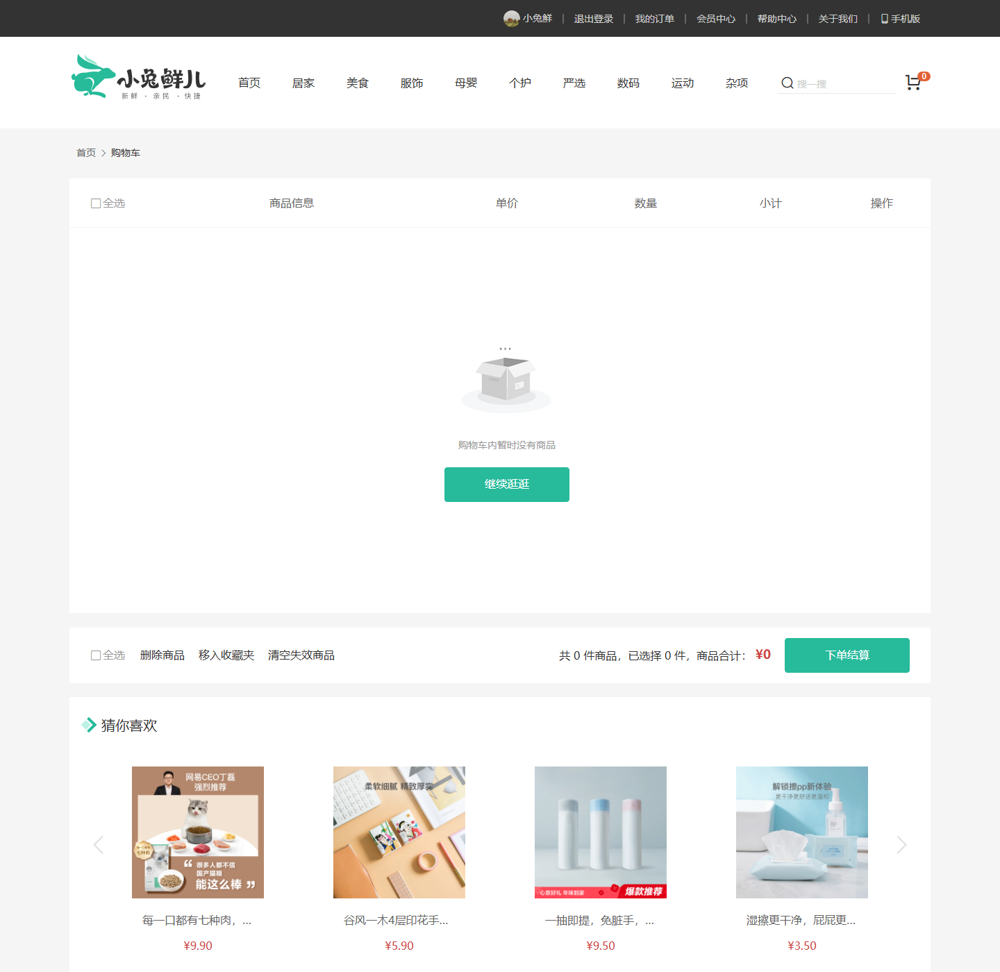

# 小兔鲜儿 Mock Service

## 项目简介

小兔鲜儿 Mock Service 是一个可独立运行的 Spring Boot 本地接口服务，为 PC 商城前端提供首页、分类、商品、购物车、结算、地址、订单、库存、优惠券、礼品卡等接口演示能力。服务使用 JSON 文件作为基础数据源，不依赖 MySQL、Redis、RabbitMQ，适合前端本地联调、页面演示和功能验证。

## 技术栈

- Java 17
- Spring Boot 3.2.5
- Spring Web
- Maven
- Jackson
- Hutool
- Lombok
- JSON 文件数据源

## 功能模块

- 首页、分类、品牌与专题数据
- 商品详情、SKU、库存状态与搜索数据
- 用户登录、资料与安全设置
- 购物车、结算、地址与订单流程
- 优惠券、礼品卡、积分与邀请功能
- 收藏、浏览历史、评价与售后功能
- 本地演示数据重置与库存一致性检查

## 目录结构

- `src/main/java`：控制器、服务和运行时逻辑
- `src/main/resources/mock`：基础静态 JSON 数据
- `data`：运行时写入的订单、购物车、地址与权益数据
- `docs`：启动说明、接口范围和数据说明

## 本地启动

```bash
mvn clean package -DskipTests
java -jar target/xtx-mock-service-1.0.0.jar
```

默认端口：`8099`

## 常用演示接口

- `/home/*`：首页与推荐内容
- `/category/*`：分类、品牌和筛选数据
- `/goods`：商品详情、SKU 与库存状态
- `/member/cart`：购物车查询、修改与删除
- `/member/order/pre`：结算页预览数据
- `/member/order`：下单、订单详情与复购
- `/member/coupon`：优惠券列表与兑换
- `/member/gift-card`：礼品卡列表与绑定

## 详细文档

- [接口说明](docs/API.md)
- [数据说明](docs/DATA.md)
- [启动说明](docs/STARTUP.md)
- [设计说明](docs/DESIGN.md)

## 项目截图

### 首页

展示首页导航、分类入口和推荐商品。


### 购物车

展示购物车商品、数量调整和结算入口。



### 结算页权益

展示优惠券、礼品卡和金额明细。


## 数据说明

- `src/main/resources/mock`：初始化演示数据
- `data/`：运行时变更数据，会记录购物车、订单、地址、优惠券和礼品卡等状态

删除运行时 JSON 文件后，可恢复到初始演示状态。

## 联调说明

- 前端开发服务器可以将 `/api/**` 代理到 `http://localhost:8099`
- 该服务主要用于页面演示、接口兼容校验和本地联调
- 公开展示时可单独运行，不依赖数据库和消息中间件

## 相关仓库

- [xiaotuxian-mall](https://github.com/18307519324az/xiaotuxian-mall)
- [xiaotuxian-mall-frontend](https://github.com/18307519324az/xiaotuxian-mall-frontend)
